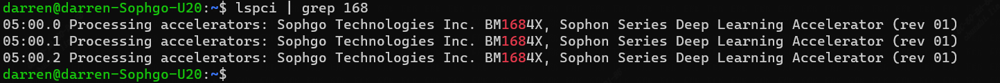

=================
SMBUS适配说明
=================

驱动安装前准备
-----------------

Step1:安装设备驱动准备

.. code-block:: shell

    用 lspci 查看服务器是否有发现硬件设备
        lspci | grep 168
    看显示的1684x芯片个数是否和安装一致(一张SC7HP75有3颗1684x, SC7FP300有8颗1684x)

下图是插上一张SC7HP75三芯卡后的查找结果:

Step2:安装依赖包

.. code-block:: shell

    sudo apt-get update
    sudo apt install g++
    sudo apt install make

卡的压力测试工具
---------------------

使用老化测试工具，按工具的指导文件进行操作(安装驱动、运行老化测试)。
压力测试过程功耗会有波动，适配目标建议是在工作温度范围内。其中SC7HP75三芯卡的芯片温度建议控制在75℃以
下，SC7FP300八芯卡的芯片温度建议控制在60℃以下。

老化测试工具的驱动安装有两种方式:

- 临时安装，重启会失效。在/bm1684x_pcie_test/data/pcie_aging/路径下，执行安装驱动脚本./make_install.sh
- 永久安装，重启仍有效，推荐采用此安装方式（因为需要操作系统加载驱动后，卡的温度读取接口才会响应）。首先需要下载官方libsophgo代码库，阅读目录下readme，按要求安装依赖包后，使用make编译生成驱动安装包再进行永久安装，可参考指令如下：

.. code-block:: shell

    /* 安装依赖包 */
    sudo -E apt update
    sudo -E apt-get install -y \
            build-essential \
            cmake \
            ninja-build \
            pkg-config \
            libncurses5-dev \
            libgflags-dev \
            libgtest-dev \
            dkms \
            gcc-aarch64-linux-gnu \
            g++-aarch64-linux-gnu \
            git

    /* 使用make */
    mkdir build && cd build
    cmake -DCMAKE_INSTALL_PREFIX=$PWD/../install ..
    make
    make driver
    make install
    make package

    /* 永久安装: 在build目录下执行 */
    sudo dpkg -i *.deb

备注：只有成功安装驱动后，BMC才能通过SMBUS读取到板卡的相关信息。

操作系统下查看卡的状态
------------------------

Step1:设置环境变量

.. code-block:: shell

    cd /bm1684x_pcie_test/data/pcie_aging/
    source envsetup.sh

Step1:输入bm-smi查看卡的状态

.. code-block:: shell

    bm-smi

卡的芯片工作范围
-------------------

以芯片温度为风扇调速目标，多芯卡工作范围为-6℃ ~ 85℃。

高于85℃会开始降频，BM1684x芯片会自动降频到最高频率的80%。降频后，需要从85℃以上回落到80℃时， BM1684x芯片的工作频率才会恢复到最高值。

对于服务器风扇调速适配，建议设计向后兼容读取多颗芯片的温度，返回的最高温度作为本张卡的温度显示在BMC传感器列表里。SC7HP75三芯片的目标工作温度控制在不高于75℃ ，SC7FP300八芯卡的目标工作温度控制在不高于60℃，保证足够的裕量长期稳定运行。

卡的散热要求:
----------------

SC7HP75散热要求：
^^^^^^^^^^^^^^^^^^^^
SC7HP75卡采用被动散热设计，主机侧需满足如下表所述的设计散热要求。

.. list-table::
   :widths: 20 30 20
   :header-rows: 0

   * - **入风口平均温度/℃**
     - **卡进风口需求最低风速/CFM**
     - **压降/inch H2O**

   * - 61
     - 14
     - 1.01

   * - 55
     - 9.2
     - 0.52

   * - 50
     - 7.1
     - 0.35

   * - 45
     - 5.6
     - 0.26

   * - 40
     - 4.6
     - 0.2

   * - 35
     - 4
     - 0.16

   * - 30
     - 3.4
     - 0.13

   * - 25及以下
     - 3
     - 0.11

SC7FP300散热要求：
^^^^^^^^^^^^^^^^^^^^^^

SC7FP300卡采用被动散热设计，主机侧需满足如下表所述的设计散热要求。

.. list-table::
   :widths: 20 30 20
   :header-rows: 0

   * - **入风口平均温度/℃**
     - **卡进风口需求最低风速/CFM**
     - **压降/inch H2O**

   * - 55
     - 37.5
     - 0.416

   * - 50
     - 27.5
     - 0.275

   * - 45
     - 22.5
     - 0.21

   * - 40
     - 18.5
     - 0.165

   * - 35
     - 16
     - 0.14

   * - 30
     - 13.8
     - 0.115

   * - 25及以下
     - 12
     - 0.096

服务器厂商BMC读取板卡信息说明
------------------------------

:服务器厂商 BMC 控制:

- SC7 系列多芯卡 Slave 地址为 0x60, CHIP1 为 0x61, CHIP2 为 0x62, 依此类推, CHIP7 为 0x67。

- 返回int类型数据时候按照高字节在前顺序发送(例如int类型数为 0x16861f1c,返回顺序为 0x16, 0x86, 0x1f, 0x1c)。

- 建议BMC适配设计向后兼容读取8颗芯片的温度，返回的最高温度作为本张卡的温度显示在 BMC传感器列表里

SC7系列 MCU 接口命令
^^^^^^^^^^^^^^^^^^^^^^

.. table::
   :widths: 25 15 10 100

   ============== ========== ======== =============================================
      含义         地址        属性        说明
   -------------- ---------- -------- ---------------------------------------------
   芯片温度         0x00       RO          unsigned byte, 单位:摄氏度
   -------------- ---------- -------- ---------------------------------------------
   单板温度         0x01       RO          unsigned byte, 单位:摄氏度
   -------------- ---------- -------- ---------------------------------------------
   单板功耗         0x02       RO          unsigned byte, 单位:瓦
   -------------- ---------- -------- ---------------------------------------------
   风扇速度占比     0x03       RO          unsigned byte, 0xff表示无风扇
   -------------- ---------- -------- ---------------------------------------------
   Vendor ID       0x10       RO            unsigned int;[31:16]:Device ID 0x1686;[15:0]:Vendor ID 0x1f1c;
   -------------- ---------- -------- ---------------------------------------------
   硬件版本         0x14       RO          unsigned byte
   -------------- ---------- -------- ---------------------------------------------
   固件版本         0x18       RO          unsigned int;[7:0]小版本号;[15:8]主版本号;[31:16]chip版本号
   -------------- ---------- -------- ---------------------------------------------
   板卡种类         0x1c       RO          unsigned byte(代表板卡种类,sc7pro是0x21)
   -------------- ---------- -------- ---------------------------------------------
   Sub Vendor ID   0x20       RO          unsigned int;[15:0]:sub Vendor ID 0x0;[31:16]:sub system ID 0x0
   -------------- ---------- -------- ---------------------------------------------
   SN ID           0x24        RO         产品序列号
   -------------- ---------- -------- ---------------------------------------------
   MCU Version     0x36        RO         unsigned byte; MCU版本号:0
   ============== ========== ======== =============================================

命令组成
^^^^^^^^^^^

先写 1 byte 的 CMD 到 i2c slave, 再读取 n byte 数据。以下为读取 CHIP0 芯片温度的例子:

.. code-block:: shell

    #先往 slave 地址为 0x60 的设备写数据 0x0
    i2c write 0x60 (slave addr) 0x0 (cmd)
    #再从 slave 地址为 0x60 的设备读取 1 byte 数据
    i2c read 0x60 (slave addr) 0x1 (n byte)

备注：

- 单板功耗只能从 0x60 的 0x02 地址读取
- unsigned int  表示该地址有效数据4个字节大小
- unsigned byte 表示该地址有效数据1个字节大小

建议的温度传感器阈值设置
------------------------------

:BMC显示的板卡温度传感器值取板卡所有芯片温度的最高值:

:SC7HP75三芯卡:

- 轻微告警上限值: 75℃
- 严重告警上限值: 80℃
- 致命告警上限值: 85℃
- 轻微告警下限值：-2℃
- 严重告警下限值：-4℃
- 致命告警下限值：-6℃

:SC7FP300八芯卡:

- 轻微告警上限值: 78℃
- 严重告警上限值: 82℃
- 致命告警上限值: 85℃
- 轻微告警下限值：-2℃
- 严重告警下限值：-4℃
- 致命告警下限值：-6℃