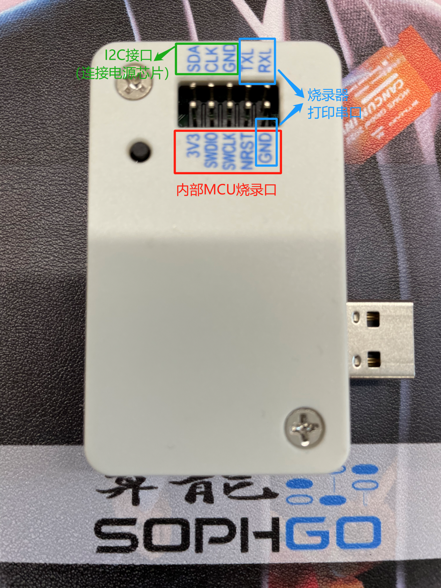
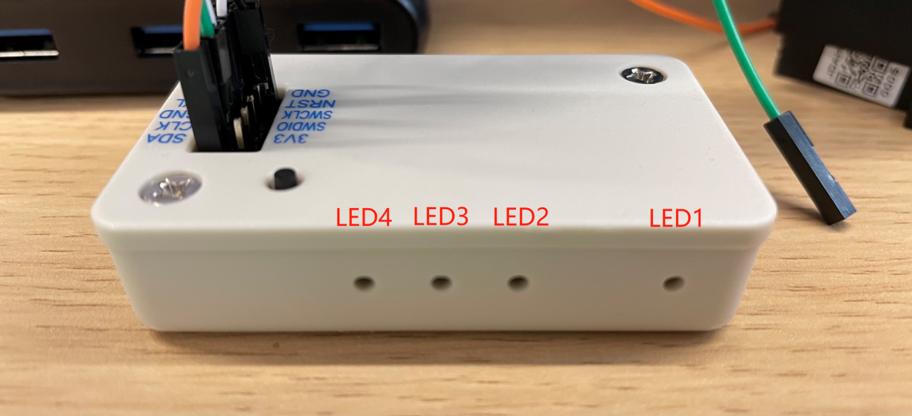

========================
烧录器组成
========================

烧录器插针功能介绍
-------------------

插针组成：

- 1.（红色部分）MCU烧录及调试接口，烧录MCU时3V3、GND、SWCLK、SWDIO必须连接。
- 2.（绿色部分）Wolfclaw烧录器连接电源芯片的I2C接口，烧录电源芯片时，SCL、SDA、GND必须连接。
- 3.（蓝色部分）Wolfclaw烧录器串口打印接线，使用串口时，使用时连接TX与RX即可。

烧录器LED灯功能介绍
-------------------

LED灯组成:

- LED1: 烧录器MCU呼吸灯：
          烧录器上电后闪烁，若停止呼吸即烧录器挂死，需重新插拔上电。
- LED2: SD卡状态灯：
          未插入SD卡或者获取配置文件失败为红灯，否则为绿灯。
- LED3: 电源芯片通信状态灯：
          上电后插入SD卡后为绿灯，但不代表已连接电源芯片。在烧录过程中若变为红灯，说明烧录失败，与电源芯片I2C通信不良。
- LED4: 烧录状态灯：
          默认状态下为红灯，当处于烧录状态时为绿灯。

烧录器USB口功能介绍
-------------------

USB接口目前仅用于烧录器供电，在旧版本中我们是通过USB接口向烧录器进行配置文件传输，
但改版之后，我们暂时仅使用SD卡存放配置文件，无需通过PC端进行额外操作。
