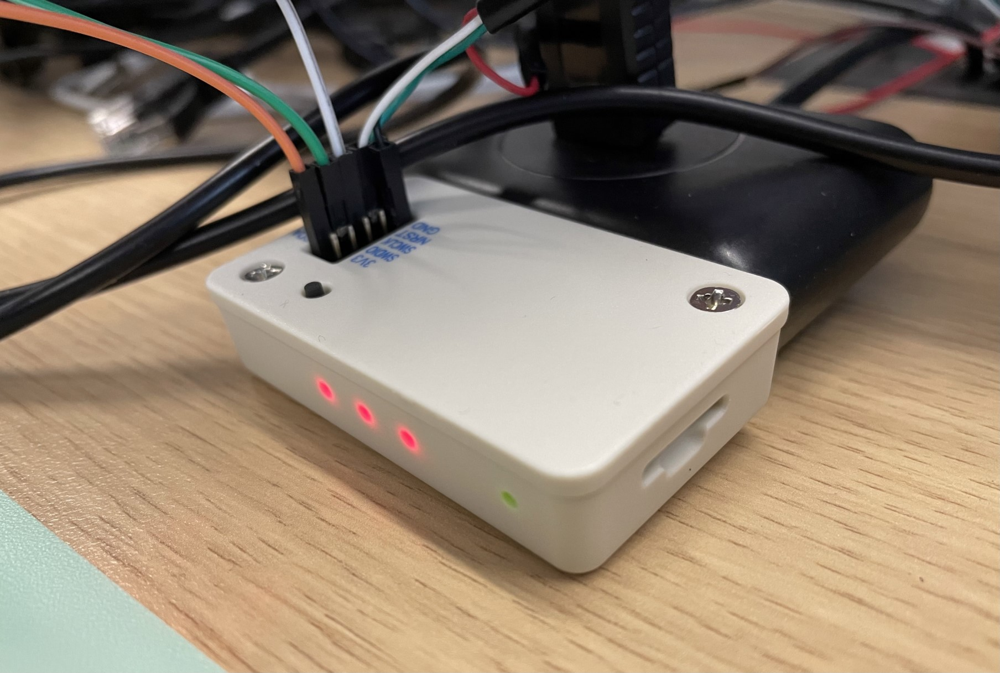
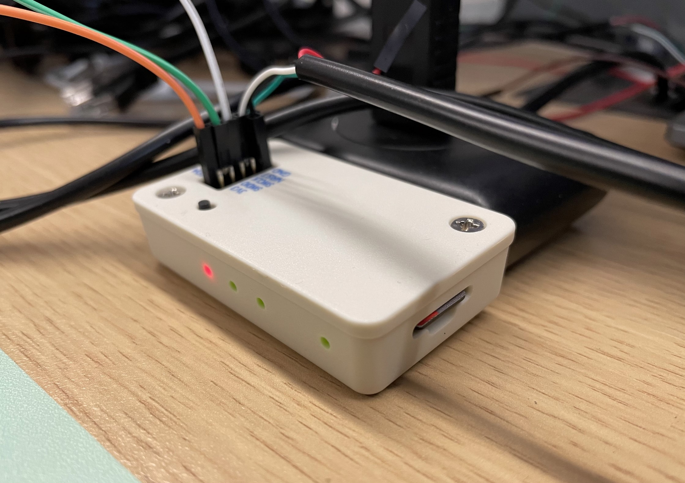
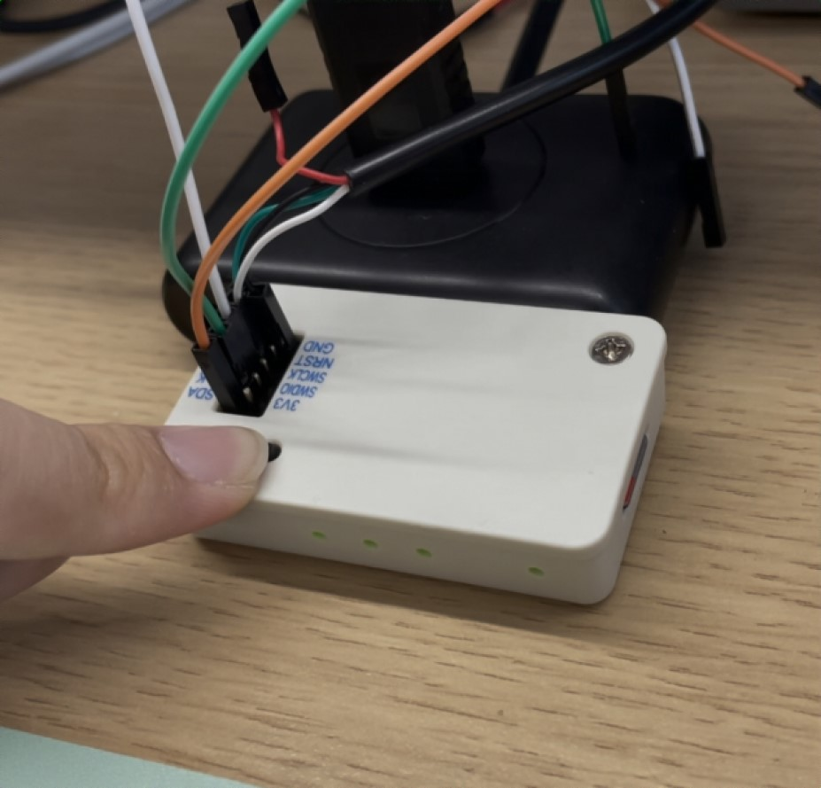
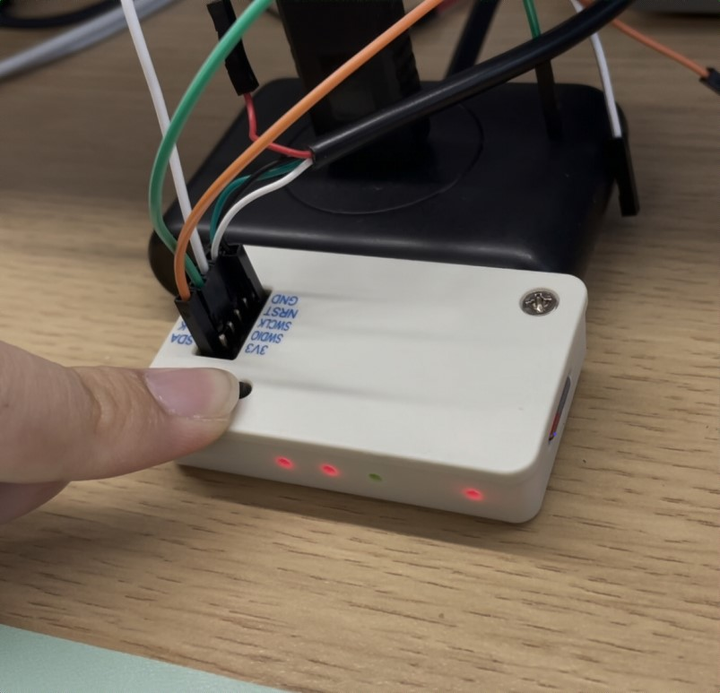
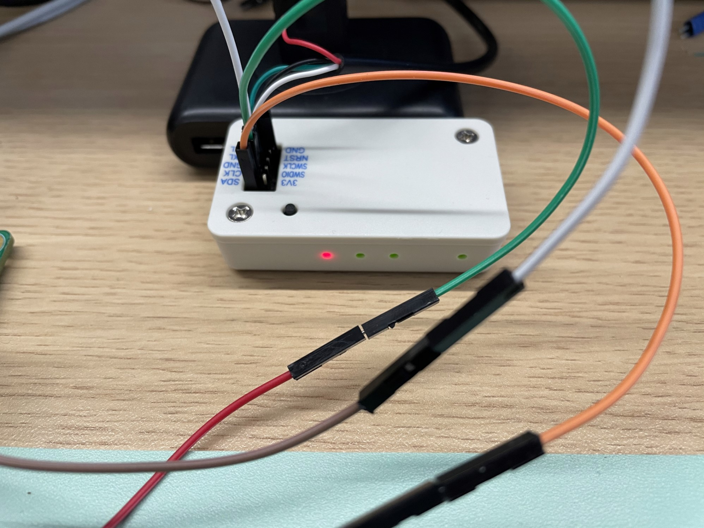

========================
按键操作演示
========================

Step1:烧录器上电
-------------------

使用USB接口供电，当烧录器上电后，4颗LED执行2次流水灯任务。此时若未插入SD卡，烧录器灯光状态如下图3：（LED1保持呼吸）

若无灯光效果说明烧录器损坏或者内部MCU未烧录。

Step2:插入SD卡
-------------------

该步骤可在上电前执行，与Step1先后顺序可替换，灯光效果如下图4

若插入SD卡后LED2为红灯，说明SD挂载或初始化失败，原因可能是SD卡或卡槽损坏、SD卡内部文件系统不符合FATfs标准

Step3:与电源芯片I2C接线连接
-------------------

对应连接烧录器以及电源芯片的I2C，包括SDA、SCL、GND。

LED3在上电后显示绿色，当后续烧录时访问电源芯片失败后会变为红色。

Step4:电源芯片上电
-----------------------

烧录前必须保证电源芯片处于上电状态。

Step5:按下按键进行烧录
-----------------------

按下按键保持至少 3 秒时间，LED4变为绿色时触发烧录，即可松开按键

此时烧录器灯光状态如下图5所示：

在烧录的过程中LED4保持为绿光，烧录过程大概为2~3s，退出烧录模式后，LED4转为红色灯光

如果在烧录后LED2变为红灯说明烧录失败，烧录过程中无法获取文件。

如果在烧录后LED3变为红灯说明烧录失败，烧录过程中与设备通信失败，现象如下图6所示：

若烧录后LED2、LED3依旧为绿色说明烧录成功，现象如下图7所示：

